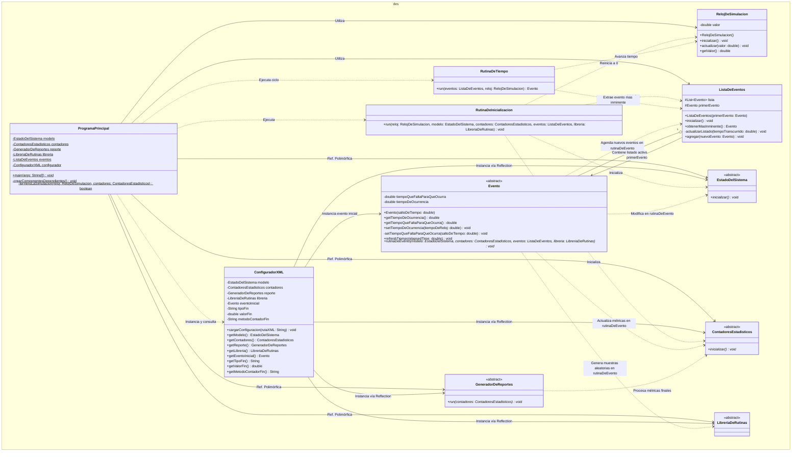

# Simulador de Eventos Discretos (DES)

Este proyecto es un motor de simulación de eventos discretos genérico escrito en Java. Está diseñado bajo una arquitectura desacoplada para permitir la modelización y simulación de distintos problemas y sistemas de colas.

La arquitectura se basa en la inyección dinámica de componentes a través de un archivo XML, utilizando la API de *Reflection* de Java para vincular e instanciar dinámicamente las clases del modelo sin necesidad de recompilar el paquete del motor.

---

## 1. Arquitectura del Motor (Paquete `des`)

El motor de simulación está contenido en el paquete `des`. **Estas clases representan el núcleo genérico y no deben modificarse**:

*   **`ProgramaPrincipal`**: Punto de entrada de la aplicación. Gestiona el ciclo de vida y la ejecución del bucle principal de simulación (`do-while`).
*   **`ConfiguradorXML`**: Encargado de leer `configuracion.xml` y cargar e instanciar dinámicamente las clases concretas del modelo y la condición de parada por reflexión.
*   **`RelojDeSimulacion`**: Administra la variable de tiempo virtual de la simulación ($t$).
*   **`ListaDeEventos`**: Administra la *Future Event List* (FEL) de sucesos futuros ordenados por el menor tiempo de ocurrencia.
*   **`RutinaDeTiempo`**: Sincroniza la lista de eventos con el avance del reloj simulado.
*   **`RutinaDeInicializacion`**: Configura las variables del motor y del modelo a su estado en $t = 0$.
*   **Clases Base Abstractas (Puntos de Extensión)**:
    *   `EstadoDelSistema`: Atributos y variables de estado del modelo.
    *   `ContadoresEstadisticos`: Acumuladores de métricas de rendimiento.
    *   `Evento`: Clase base para cada suceso con firma abstracta `rutinaDeEvento()`.
    *   `LibreriaDeRutinas`: Generador de variables aleatorias.
    *   `GeneradorDeReportes`: Procesamiento final e impresión de métricas.

---

## 2. Diagramas de Diseño (UML)

### A. Diagrama de Clases UML


---

## 3. 🚀 ¿Cómo implementar una nueva simulación?

### Paso 1: Crear los paquetes y clases concretas
1. **Crear un paquete nuevo:** Crea un paquete para tu problema, por ejemplo: `ejercicio1`.
2. **Heredar de los componentes base:** Implementa las clases concretas heredando de las abstractas del paquete `des`:
   *   `EstadoDelSistema` (ej. `ejercicio1.estadoDelSistema.Ejercicio1`)
   *   `ContadoresEstadisticos` (ej. `ejercicio1.componentesPropios.ContadoresEstadisticosEjercicio1`)
   *   `LibreriaDeRutinas` (ej. `ejercicio1.componentesPropios.LibreriaDeRutinasEjercicio1`)
   *   `GeneradorDeReportes` (ej. `ejercicio1.componentesPropios.GeneradorDeReportesEjercicio1`)
3. **Crear los Eventos:** Crea clases que hereden de `Evento` (ej. `ejercicio1.eventos.EventoArribarACola`), implementando su correspondiente lógica en el método `rutinaDeEvento()`.

### Paso 2: Configurar `configuracion.xml`
Vincula tus clases del modelo con el motor genérico configurándolas en el archivo XML de la raíz:

```xml
<?xml version="1.0" encoding="UTF-8"?>
<simulacion>
    <!-- 1. Clases concretas del modelo -->
    <modelo>ejercicio1.estadoDelSistema.Ejercicio1</modelo>
    <contadores>ejercicio1.componentesPropios.ContadoresEstadisticosEjercicio1</contadores>
    <reporte>ejercicio1.componentesPropios.GeneradorDeReportesEjercicio1</reporte>
    <libreria>ejercicio1.componentesPropios.LibreriaDeRutinasEjercicio1</libreria>
    
    <!-- 2. Evento inicial detonador -->
    <eventoInicial>
        <clase>ejercicio1.eventos.EventoArribarACola</clase>
        <metodoTiempo>tiempoEntreArribosSolicitudes</metodoTiempo>
    </eventoInicial>
    
    <!-- 3. Condición de fin de simulación (tipo: tiempo o cantidad) -->
    <condicionFin>
        <tipo>tiempo</tipo>
        <valor>1000.0</valor>
        <!-- dejar vacío si tipo es tiempo -->
        <metodoContador></metodoContador> 
    </condicionFin>
</simulacion>
```

### Paso 3: Ejecutar la simulación
1. Ejecuta el método `main()` de la clase [ProgramaPrincipal.java](file:///c:/Users/Pc/Documents/UTN/Beca/simuladorJava/des/ProgramaPrincipal.java).
2. El simulador cargará el XML, instanciará los componentes dinámicamente y computará la simulación hasta cumplir con la condición de fin especificada.

---

## 4. Requisitos y Notas de Implementación
*   **Constructores por defecto:** Todas las clases hijas que instancies mediante XML deben proveer un **constructor vacío explícito o implícito** para poder ser instanciadas por reflexión.
*   **Nombres y mayúsculas:** Las rutas en el XML son sensibles a mayúsculas y minúsculas y deben coincidir exactamente con los nombres de paquete y clase en Java.
*   **Muestreo aleatorio:** En la clase que extienda `LibreriaDeRutinas`, programa funciones que retornen valores (`double` o `int`) que simulen las variables estocásticas del sistema.

